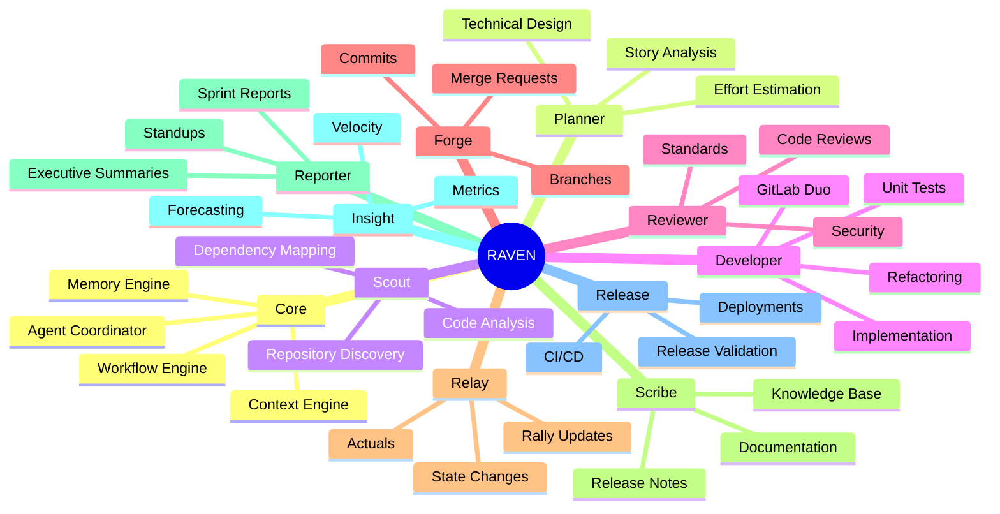

```mermaid
mindmap
  root((RAVEN))

    Core

      Context Engine
      Workflow Engine
      Agent Coordinator
      Memory Engine

    Planner

      Story Analysis
      Technical Design
      Effort Estimation

    Scout

      Repository Discovery
      Dependency Mapping
      Code Analysis

    Developer

      GitLab Duo
      Implementation
      Refactoring
      Unit Tests

    Reviewer

      Code Reviews
      Standards
      Security

    Forge

      Branches
      Commits
      Merge Requests

    Relay

      Rally Updates
      Actuals
      State Changes

    Scribe

      Documentation
      Release Notes
      Knowledge Base

    Reporter

      Standups
      Sprint Reports
      Executive Summaries

    Insight

      Metrics
      Velocity
      Forecasting

    Release

      CI/CD
      Deployments
      Release Validation
```