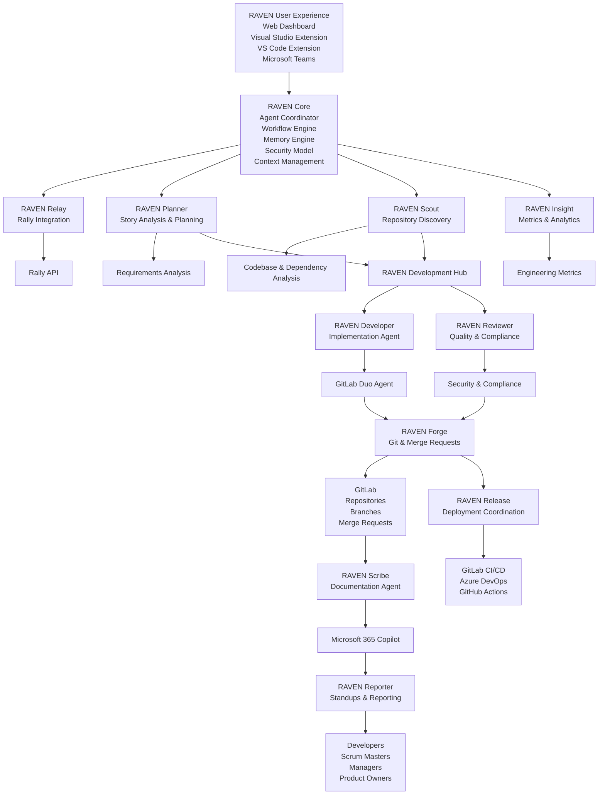

```mermaid
flowchart TB

    UI["RAVEN User Experience<br/>Web Dashboard<br/>Visual Studio Extension<br/>VS Code Extension<br/>Microsoft Teams"]

    CORE["RAVEN Core<br/>Agent Coordinator<br/>Workflow Engine<br/>Memory Engine<br/>Security Model<br/>Context Management"]

    UI --> CORE

    RELAY["RAVEN Relay<br/>Rally Integration"]
    PLANNER["RAVEN Planner<br/>Story Analysis & Planning"]
    SCOUT["RAVEN Scout<br/>Repository Discovery"]
    INSIGHT["RAVEN Insight<br/>Metrics & Analytics"]

    CORE --> RELAY
    CORE --> PLANNER
    CORE --> SCOUT
    CORE --> INSIGHT

    RALLY["Rally API"]
    REPO_ANALYSIS["Codebase & Dependency Analysis"]
    STORY_ANALYSIS["Requirements Analysis"]
    METRICS["Engineering Metrics"]

    RELAY --> RALLY
    PLANNER --> STORY_ANALYSIS
    SCOUT --> REPO_ANALYSIS
    INSIGHT --> METRICS

    DEV_HUB["RAVEN Development Hub"]

    PLANNER --> DEV_HUB
    SCOUT --> DEV_HUB

    DEVELOPER["RAVEN Developer<br/>Implementation Agent"]
    REVIEWER["RAVEN Reviewer<br/>Quality & Compliance"]

    DEV_HUB --> DEVELOPER
    DEV_HUB --> REVIEWER

    DUO["GitLab Duo Agent"]
    SECURITY["Security & Compliance"]

    DEVELOPER --> DUO
    REVIEWER --> SECURITY

    FORGE["RAVEN Forge<br/>Git & Merge Requests"]

    DUO --> FORGE
    SECURITY --> FORGE

    GITLAB["GitLab<br/>Repositories<br/>Branches<br/>Merge Requests"]

    FORGE --> GITLAB

    SCRIBE["RAVEN Scribe<br/>Documentation Agent"]

    GITLAB --> SCRIBE

    COPILOT["Microsoft 365 Copilot"]

    SCRIBE --> COPILOT

    REPORTER["RAVEN Reporter<br/>Standups & Reporting"]

    COPILOT --> REPORTER

    STAKEHOLDERS["Developers<br/>Scrum Masters<br/>Managers<br/>Product Owners"]

    REPORTER --> STAKEHOLDERS

    RELEASE["RAVEN Release<br/>Deployment Coordination"]

    FORGE --> RELEASE

    CICD["GitLab CI/CD<br/>Azure DevOps<br/>GitHub Actions"]

    RELEASE --> CICD
```