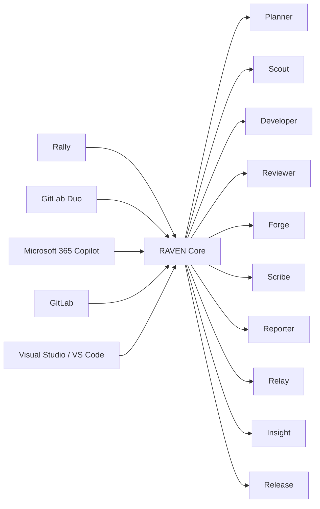

# RAVEN
## Rally-Aware AI Virtual Engineering Navigator

### Product Design & Architecture Specification
**Version:** 1.0  
**Status:** Initial Design  
**Author:** RAVEN Founding Team

---

# Executive Summary

RAVEN is an AI-driven development orchestration platform that bridges:

- Rally (Broadcom Agile Central)
- GitLab Repositories
- GitLab Duo Agent
- Microsoft 365 Copilot
- Visual Studio
- Visual Studio Code

RAVEN acts as an Engineering Navigator, guiding developers from requirement intake through implementation, testing, documentation, merge request creation, deployment, and reporting.

The platform introduces a multi-agent architecture where specialized AI agents collaborate to automate routine engineering activities while keeping developers in full control.

---

# Vision

> Transform software delivery by providing a single intelligent workspace where requirements become production-ready software.

---

# Mission

Reduce context switching, accelerate delivery, and improve traceability by connecting business requirements, source code, AI assistants, and engineering workflows.

---

# Product Pillars

## Engineering Intelligence

Understand stories, defects, repositories, and implementation impacts.

## AI Collaboration

Leverage both GitLab Duo and Microsoft 365 Copilot.

## Full Lifecycle Automation

Automate workflow from:

```text
Requirement
→ Planning
→ Development
→ Review
→ Merge Request
→ Documentation
→ Deployment
→ Reporting
```

## Developer Control

AI proposes.

Humans approve.

---

# Platform Architecture



---

# Agent Architecture

## RAVEN Core

### Responsibility

Central orchestration engine.

### Features

- Agent coordination
- Workflow execution
- Session context
- User preferences
- Security controls
- Event routing

### Interfaces

```http
POST /api/agent/execute
POST /api/agent/workflow
GET  /api/context
```

---

# RAVEN Relay

## Purpose

Rally integration engine.

### Responsibilities

- Retrieve assigned stories
- Retrieve assigned defects
- Retrieve sprint information
- Update status
- Update notes
- Update actuals

### Rally Objects

```text
HierarchicalRequirement
Defect
Task
Iteration
Project
```

### Outputs

```json
{
  "id": "US12345",
  "title": "Customer API",
  "appName": "Customer Portal",
  "estimate": 5
}
```

---

# RAVEN Planner

## Purpose

Story-to-implementation planner.

### Responsibilities

- Analyze requirements
- Generate technical tasks
- Create execution plans
- Identify dependencies
- Estimate effort

### Output Example

```json
{
  "storyId": "US12345",
  "tasks": [
    "Update controller",
    "Update service",
    "Create tests"
  ],
  "risk": "Medium"
}
```

---

# RAVEN Scout

## Purpose

Repository intelligence agent.

### Responsibilities

- Repository mapping
- Dependency mapping
- Architecture discovery
- Impact analysis

### Output

```json
{
  "repository": "customer-portal",
  "filesAffected": [
    "CustomerController.cs",
    "CustomerService.cs"
  ]
}
```

---

# RAVEN Developer

## Purpose

Implementation agent.

### Integrates With

```text
GitLab Duo Agent
```

### Responsibilities

- Create implementation prompts
- Generate code changes
- Generate tests
- Propose refactoring

### Workflow

```text
Story
   ↓
Prompt
   ↓
GitLab Duo
   ↓
Code Proposal
```

---

# RAVEN Reviewer

## Purpose

Code review and governance.

### Responsibilities

- Coding standards
- Security validation
- Architecture compliance
- Test coverage analysis

### Checks

```text
SOLID Principles
Naming Standards
Security Risks
Coverage Thresholds
```

---

# RAVEN Forge

## Purpose

Git operations.

### Responsibilities

- Create branches
- Create commits
- Push changes
- Open Merge Requests

### Naming Standards

Feature:

```text
feature/US12345-customer-api
```

Bug Fix:

```text
bugfix/DE54321-auth-fix
```

Commit:

```text
US12345 - Implement Customer API
```

---

# RAVEN Scribe

## Purpose

Documentation engine.

### Integrates With

```text
Microsoft 365 Copilot
```

### Produces

- Release notes
- API documentation
- Technical summaries
- Architecture documents

### Example

```text
Generate Release Notes
Generate Swagger Documentation
Generate Design Summary
```

---

# RAVEN Reporter

## Purpose

Communication agent.

### Outputs

- Daily standups
- Sprint reviews
- Team reports
- Executive dashboards

### Example

```text
Yesterday:
Completed DE54321

Today:
Continue US12345

Blockers:
None
```

---

# RAVEN Insight

## Purpose

Engineering analytics.

### Metrics

```text
Velocity
Lead Time
Cycle Time
MR Success Rate
Defect Trends
```

### Dashboards

```text
Personal Dashboard
Team Dashboard
Sprint Dashboard
Executive Dashboard
```

---

# RAVEN Release

## Purpose

Deployment orchestration.

### Integrations

```text
GitLab CI
Azure DevOps
GitHub Actions
```

### Responsibilities

- Validate readiness
- Trigger deployment
- Publish release notes
- Update Rally

---

# User Interface Design

## Command Center

```text
+------------------------------------------------+
| RAVEN Command Center                           |
+------------------------------------------------+

Work Assigned Today

US12345 - Customer API
DE54321 - Auth Fix

Open Merge Requests: 2

Stories In Progress: 3

----------------------------------------------

Suggested Action

Continue US12345

[Analyze]
[Implement]
[Review]
[Create MR]

----------------------------------------------

Recent Activity

✓ Rally Synced
✓ Tests Passed
✓ MR Created
✓ Story Updated
```

---

# Chat Experience

```text
Developer:
Implement US12345

RAVEN:
Repository identified.

Application:
Customer Portal

Affected Components:
- CustomerController
- CustomerService

Shall I generate an implementation plan?
```

---

# IDE Integration

## Visual Studio

### Features

- Tool Window
- Story Explorer
- AI Chat
- Code Review Pane
- MR Manager

---

## VS Code

### Features

- Activity Bar
- Tree View
- Command Palette Commands
- Inline Chat
- Merge Request Panel

---

# Configuration

## User Settings

```json
{
  "rallyUrl": "",
  "rallyApiKey": "",
  "gitlabUrl": "",
  "gitlabToken": "",
  "defaultBranch": "main",
  "autoUpdateRally": true,
  "generateDocs": true
}
```

---

# Backend Architecture

## Technology Stack

### Runtime

```text
.NET 8
ASP.NET Core
SignalR
```

### Storage

```text
SQLite
SQL Server
PostgreSQL
```

### AI Integration

```text
GitLab Duo

Microsoft 365 Copilot

Azure OpenAI (Optional)
```

### Extensions

```text
Visual Studio VSIX

VS Code Extension
```

---

# MVP Features

## Phase 1

### Story Management

- Connect Rally
- Load Stories
- Load Defects
- Parse Metadata

### Development

- Repository Discovery
- GitLab Duo Integration
- Branch Creation
- MR Creation

### Synchronization

- Update Rally Notes
- Update Rally State
- Update Actuals

---

## Phase 2

### Productivity

- Copilot Integration
- Release Notes
- Documentation
- Daily Standups

### Engineering

- Test Generation
- Security Review
- CI/CD Integration

---

## Phase 3

### Intelligence

- Multi-Agent Collaboration
- Sprint Forecasting
- Architecture Guidance
- Engineering Insights

---

# Success Metrics

## Productivity

- 30% reduction in context switching
- 25% faster story completion
- 50% reduction in manual Rally updates

## Quality

- Increased test coverage
- Reduced defect leakage
- Improved code review consistency

## Traceability

```text
Story
  ↓
Code
  ↓
Commit
  ↓
Merge Request
  ↓
Deployment
  ↓
Release Notes
```

---

# Product Statement

**RAVEN (Rally-Aware AI Virtual Engineering Navigator) is a multi-agent engineering platform that connects Rally, GitLab Duo, Microsoft 365 Copilot, Visual Studio, and VS Code into a unified software delivery experience, providing intelligent guidance from requirement to release while maintaining complete traceability across the development lifecycle.**