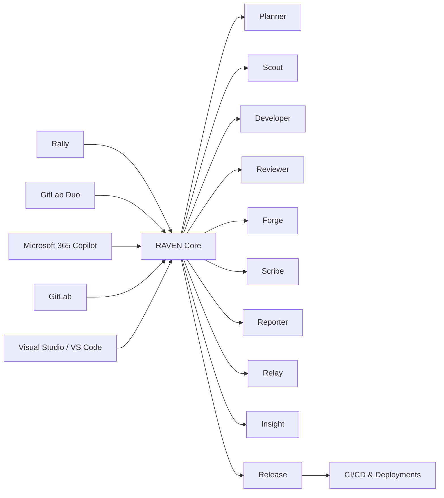

```mermaid
flowchart LR

    RALLY["Rally"]
    DUO["GitLab Duo"]
    COPILOT["Microsoft 365 Copilot"]
    GITLAB["GitLab"]
    IDE["Visual Studio / VS Code"]

    CORE["RAVEN Core"]

    RALLY --> CORE
    DUO --> CORE
    COPILOT --> CORE
    GITLAB --> CORE
    IDE --> CORE

    CORE --> PLANNER["Planner"]
    CORE --> SCOUT["Scout"]
    CORE --> DEV["Developer"]
    CORE --> REVIEW["Reviewer"]
    CORE --> FORGE["Forge"]
    CORE --> SCRIBE["Scribe"]
    CORE --> REPORT["Reporter"]
    CORE --> RELAY["Relay"]
    CORE --> INSIGHT["Insight"]
    CORE --> RELEASE["Release"]

    RELEASE --> CICD["CI/CD & Deployments"]
```
